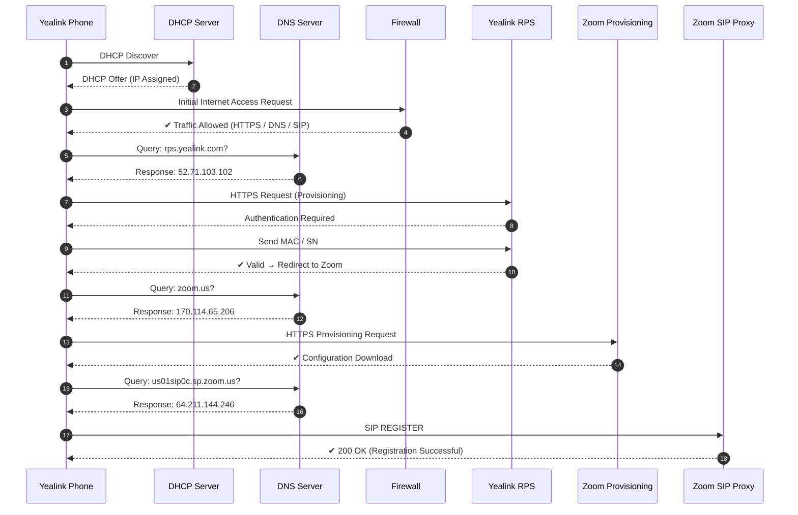

# 🔄 Auto-Provisioning de Dispositivos Yealink Integrados con Zoom Phone

**Autor:** Jhoan Sebastian Montañez Alvis  
Estudiante de Ingeniería de Telecomunicaciones (8° semestre)  
Técnico III Profesional de Equipos de Infraestructura  

2026

---

## I. INTRODUCTION

The growth of unified communications has increased the need for efficient deployment mechanisms for IP telephony devices. Traditional manual configuration is time-consuming and prone to human error.

Auto-provisioning enables automated device configuration through centralized servers, allowing scalable and consistent deployments. Devices from Yealink can be integrated with Zoom Phone to streamline provisioning and endpoint management.

In enterprise environments, rapid deployment and operational efficiency are critical. Implementing auto-provisioning reduces configuration time, minimizes errors, and ensures standardized configurations across large-scale VoIP infrastructures.

This approach is essential for organizations requiring scalability, reliability, and centralized management in IP telephony environments.

## II. BACKGROUND

Voice over IP (VoIP) enables voice communication over IP networks, replacing traditional telephony systems. Session Initiation Protocol (SIP) is used for signaling and session control.

Dynamic Host Configuration Protocol (DHCP) provides automatic IP addressing. DHCP Option 66 allows devices to locate the provisioning server.

Auto-provisioning allows devices to download configuration files from remote servers, enabling zero-touch deployment without manual intervention.

---

## III. METHODOLOGY
La implementación del sistema de auto-provisionamiento se basa en los siguientes componentes:

- Dispositivos Yealink
- Plataforma Zoom Phone
- Servidor de aprovisionamiento (HTTP/HTTPS)
- Red con servicio DHCP
---
## 🔄 Yealink Automatic Phone Provisioning Diagram with Zoom

  

---

## 🌐 Network and Firewall Requirements

### A. Network Requirements

For proper operation of the auto-provisioning process and Zoom Phone services, the following network conditions must be met:

- A dedicated VLAN or network segment with DHCP enabled or properly configured static IP addressing.
- A wired network access point is recommended to ensure stability. Yealink IP phones support PC passthrough ports, allowing shared connectivity if required.
- Stable internet connectivity with low latency and minimal packet loss is required to ensure proper communication with external services.

---

### B. Firewall Requirements

Firewall configuration must allow outbound connectivity from internal hosts to external Zoom services and provisioning platforms.

In environments using Fortinet, predefined address groups and service objects for Zoom are typically available and can be directly referenced within firewall policies.

#### Policy Configuration

 **Policy Name:** Zoom_Access  
  Identifies the rule associated with Zoom services.

- **Source (Origin):** LAN / VLAN / Subnet / Interface  
  Defines internal networks where devices (IP phones or users) are located.

- **Destination:** Zoom service groups (Zoom.us-Zoom.Meeting)  
  Allows traffic only to authorized Zoom-related domains and services.

- **Schedule:** Always  
  Ensures continuous availability (24/7 operation).

- **Service:** Internet Services (HTTPS, DNS, SIP)  
  Enables required protocols for signaling and provisioning.

- **Action:** Allow  
  Permits outbound communication.

- **NAT:** Enabled  
  Required for internal devices to access external services.

- **SSL Inspection:** Disabled  
  SSL/TLS inspection must be disabled to avoid interference with encrypted Zoom traffic, which may cause registration or media issues.

---

### C. FQDN and Domain Requirements

If predefined application groups are not available, the firewall administrator must manually create address objects using FQDN.

- `*.zoom.us`
- `us01sip0c.sp.zoom.us`
- `*.zoom.com`
- `*.yealink.com`  
- `*.cloudfront.net` "opcional para mejorar trafico de llamadas"

### D. Zoom Official Requirements

For detailed and updated firewall policies, refer to the official Zoom documentation:

🔗 https://support.zoom.com/hc/es/article?id=zm_kb&sysparm_article=KB0060560

---

### D. FQDN Requirements

If application-based rules are unavailable, allow the following domains:

- `*.zoom.us`
- `*.zoom.com`
- `us01sip0c.sp.zoom.us`
- `*.yealink.com`

---

## 🔐 Technical and Security Considerations

- Ensure reliable DNS resolution for all services.
- Allow outbound HTTPS, DNS, and SIP traffic.
- Avoid SSL/TLS inspection for real-time communication.
- Monitor latency, jitter, and packet loss.
- Enable access to NTP/SNTP servers for time synchronization.
- Yealink domains (`*.yealink.com`) are only required during provisioning.
- RPS access is required for zero-touch provisioning.

------

## V. RESULTS  
The implementation enabled zero-touch provisioning, achieving rapid device deployment, consistent configuration, and successful SIP registration ("200 OK") through automated integration with Zoom infrastructure.

## VI. CONCLUSION  
The auto-provisioning model ensures fast, reliable, and scalable IP telephony deployment by enabling direct connectivity between Yealink devices and Zoom services, significantly reducing provisioning time and operational overhead.
