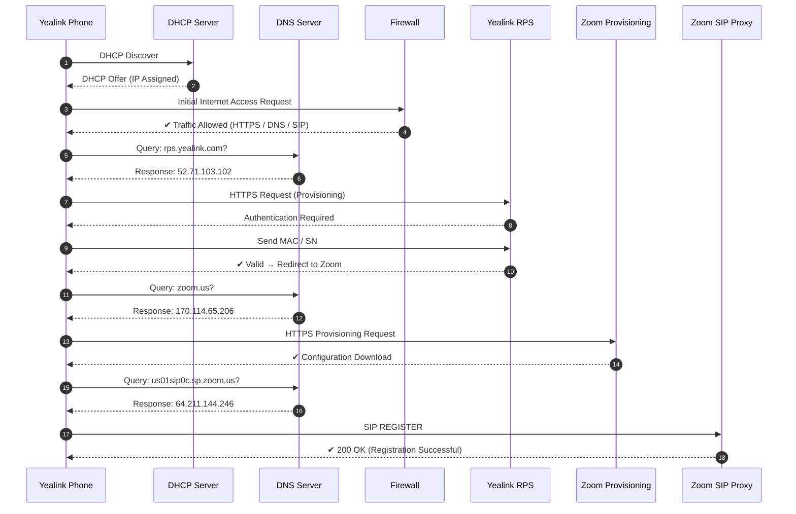

# 📡 Yealink Auto-Provisioning with Zoom

## 📖 Overview

This document describes the end-to-end provisioning workflow of a Yealink device integrating with Zoom services.
It includes network initialization, security validation, cloud provisioning, and SIP registration.

---
## 🔄 Yealink Automatic Phone Provisioning Diagram with Zoom

  

---

## Process Breakdown 

* **DHCP Server**
  Provides IP addressing and network parameters (IP, gateway, DNS) once the device connects to the customer network.

* **DNS Server**
  Resolves domain names to IP addresses (e.g., rps.yealink.com, zoom.us, SIP proxy), enabling communication with external services.

* **Firewall**
  Enforces security policies and allows required outbound traffic (HTTPS, DNS, SIP) after initial validation.

* **Yealink RPS**
  Authenticates the device using MAC/Serial Number and redirects it to the appropriate provisioning platform.

* **Zoom Provisioning Server**
  Delivers device configuration via HTTPS, including account settings and service param

* **Zoom SIP Proxy**
  Handles SIP registration, proxy and call signaling, confirming successful device registration (200 OK).

---

## 🌐 Network Requirements

| Service | Protocol | Port        |
| ------- | -------- | ----------- |
| DHCP    | UDP      | 67/68       |
| DNS     | UDP/TCP  | 53          |
| HTTPS   | TCP      | 443         |
| SIP     | UDP/TCP  | 5060 / 5061 |

---

## 🔐 Notes

* Ensure firewall policies allow outbound HTTPS, DNS, and SIP
* Verify DNS resolution for Yealink and Zoom services
* RPS access is required for zero-touch provisioning
* Arrival at ntp or sntp servers is required for date and time updates
---

