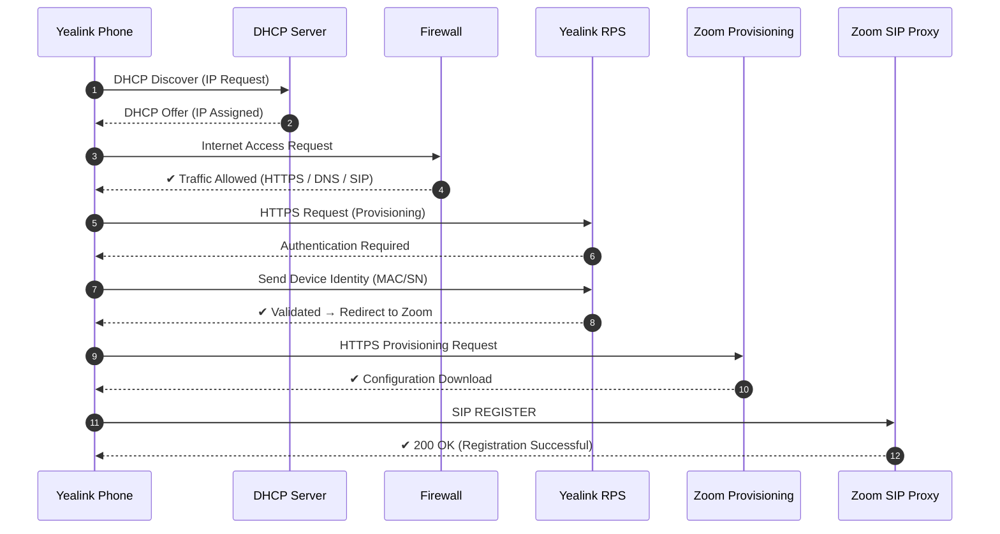

# 📡 Yealink Auto-Provisioning with Zoom

## 📖 Overview

This document describes the end-to-end provisioning workflow of a Yealink device integrating with Zoom services.
It includes network initialization, security validation, cloud provisioning, and SIP registration.

---

## 🔄 Provisioning Flow Diagram

---

## 🧠 Process Breakdown

### 1. Network Initialization

* Device requests IP address via DHCP
* Network parameters are assigned

### 2. Security Validation

* Firewall evaluates outbound traffic
* Required protocols are allowed

### 3. Device Authentication

* Yealink RPS validates device identity
* Redirects device to Zoom provisioning platform

### 4. Service Provisioning

* Device downloads configuration from Zoom

### 5. SIP Registration

* Device registers against Zoom SIP Proxy
* Communication is established

---

## 🌐 Network Requirements

| Service | Protocol | Port        |
| ------- | -------- | ----------- |
| DHCP    | UDP      | 67/68       |
| DNS     | UDP/TCP  | 53          |
| HTTPS   | TCP      | 443         |
| SIP     | UDP/TCP  | 5060 / 5061 |

---

## ✅ Result

✔ Device successfully provisioned
✔ Configuration applied
✔ SIP Registration Successful
✔ Ready for operation

---

## 🔐 Notes

* Ensure firewall policies allow outbound HTTPS, DNS, and SIP
* Verify DNS resolution for Yealink and Zoom services
* RPS access is required for zero-touch provisioning

---

